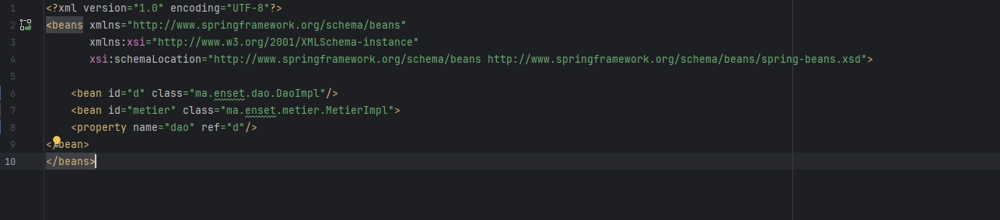

# TP Injection de Dépendances
Ce projet démontre différentes méthodes d'injection de dépendances en Java, avec et sans le framework Spring.
## Partie 1 : Injection de Dépendances
### Structure du Projet

#### Interfaces

- IDao : Interface avec la méthode getData()
- IMetier : Interface avec la méthode calcul()

#### Implémentations

- DaoImpl : Implémentation de l'interface IDao
- MetierImpl : Implémentation de l'interface IMetier utilisant IDao (couplage faible)

### Méthodes d'Injection des Dépendances
#### 1. Instanciation Statique
   La classe Presentation1 contient un exemple d'instanciation statique où les dépendances sont créées et injectées directement dans le code.

#### 2. Instanciation Dynamique
   La classe Presentation2 montre comment instancier dynamiquement les classes à partir des noms spécifiés dans un fichier de configuration presentation2.txt

#### 3. Utilisation du Framework Spring
   ###### a. Version XML
   
Fichier de configuration config.xml: 

Presentation avec Spring en utilisant fichier XML

###### b. Version Annotations

Classes avec annotations:

Presentation avec annotation 

### Technologies Utilisées

- Java
-Spring Framework

### Comment Exécuter

###### 1.Clonez le repository
###### 2.Importez le projet dans votre IDE
###### 3.Exécutez les différentes classes de présentation (Presentation1, Presentation2, Presentation3SpringXml, Presentation4Annotation)